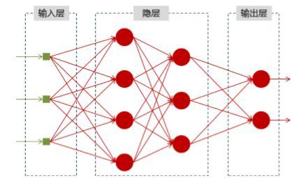
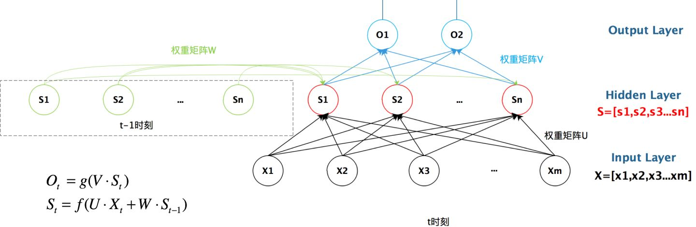
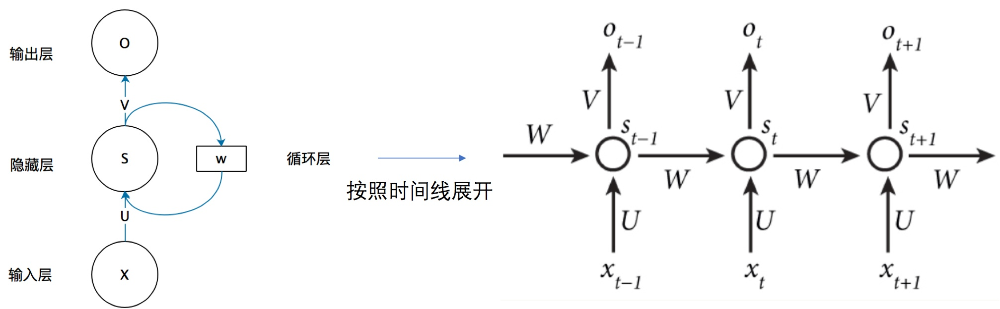
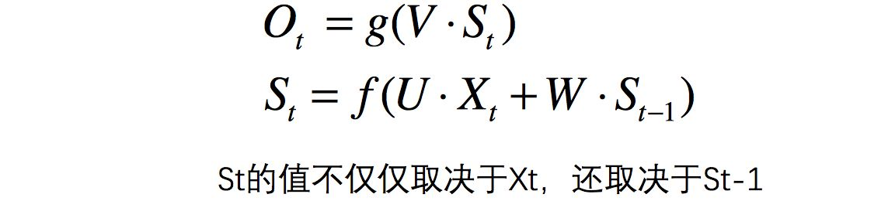
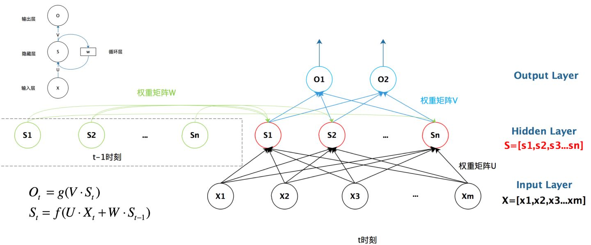

## 神经网络基础

神经网络可以当做是能够拟合任意函数的黑盒子，只要训练数据足够，给定特定的 x，就能得到希望的 y，结构图如下：

将神经网络模型训练好之后，在输入层给定一个 x，通过网络之后就能够在输出层得到特定的 y，那么既然有了这么强大的模型，为什么还需要 RNN（循环神经网络）呢？

## 为什么需要 RNN（循环神经网络）

他们都只能单独的取处理一个个的输入，前一个输入和后一个输入是完全没有关系的。但是，某些任务需要能够更好的处理序列的信息，即前面的输入和后面的输入是有关系的。

> 比如，当我们在理解一句话意思时，孤立的理解这句话的每个词是不够的，我们需要处理这些词连接起来的整个序列； 当我们处理视频的时候，我们也不能只单独的去分析每一帧，而要分析这些帧连接起来的整个序列。

## RNN 结构

首先看一个简单的循环神经网络如，它由输入层、一个隐藏层和一个输出层组成：

如果把上面有 W 的那个带箭头的圈去掉，它就变成了最普通的全连接神经网络。x 是一个向量，它表示输入层的值（这里面没有画出来表示神经元节点的圆圈）；s 是一个向量，它表示隐藏层的值（这里隐藏层面画了一个节点，你也可以想象这一层其实是多个节点，节点数与向量 s 的维度相同）；

U 是输入层到隐藏层的权重矩阵，o 也是一个向量，它表示输出层的值；V 是隐藏层到输出层的权重矩阵。

那么，现在我们来看看 W 是什么。循环神经网络的隐藏层的值 s 不仅仅取决于当前这次的输入 x，还取决于上一次隐藏层的值 s。权重矩阵 W 就是隐藏层上一次的值作为这一次的输入的权重

我们从上图就能够很清楚的看到，上一时刻的隐藏层是如何影响当前时刻的隐藏层的。

如果我们把上面的图展开，循环神经网络也可以画成下面这个样子：

现在看上去就比较清楚了，这个网络在 t 时刻接收到输入 之后，隐藏层的值是  ，输出值是  。关键一点是，  的值不仅仅取决于  ，还取决于  。我们可以用下面的公式来表示循环神经网络的计算方法：

## 总结

## 参考链接

- [一文搞懂 RNN（循环神经网络）基础篇](https://zhuanlan.zhihu.com/p/30844905)
- [零基础入门深度学习(5) - 循环神经网络](https://zybuluo.com/hanbingtao/note/541458)
